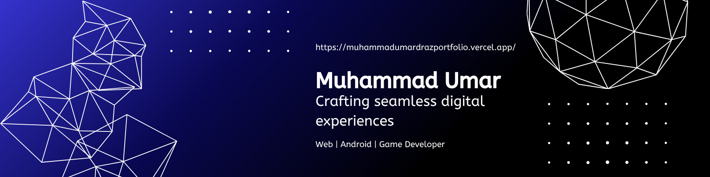

<!-- =========================================================== -->
<!-- 👋 HEADER 👋 -->
<!-- =========================================================== -->

  
<h1>👋 Hi, I'm <strong>Muhammad Umar Draz</strong></h1>
<h3> 
    
</h3>

<!-- =========================================================== -->
<!-- 👇 INFO 👇 -->
<!-- =========================================================== -->
<ul>
  <li>🔭 Currently working on <strong>MovioLive a MERN Stack based Web App</strong></li>
  <li>🌱 Currently learning <strong>Web App development</strong></li>
  <li>👩🏻‍💻 All of my projects are available at 
    <strong><a href="https://github.com/umardraz2004?tab=repositories">My Repositories</a></strong>
  </li>
  <li>📫 Reach me at <a href="https://mail.google.com/mail/?view=cm&fs=1&to=umardraz6965@gmail.com" target="_blank">Contact us</a></li>

  <li>⚡ Fun fact: <strong>It's only 0 or 1</strong></li>
</ul>

<!-- =========================================================== -->
<!-- 💻 BEAUTIFUL GROUPED ICONS TECH STACK 💻 -->
<!-- =========================================================== -->
<h1>💻 Tech Stack</h1>

<!-- 🎨 Frontend -->
<h3>🎨 Frontend</h3>

  

<!-- ⚙️ Backend -->
<h3>⚙️ Backend</h3>

  

<!-- 📱 Mobile & Game Dev -->
<h3>📱 Mobile & Game Development</h3>

  

<!-- 💾 Databases -->
<h3>💾 Databases</h3>

  
  
  

<!-- 🛠️ Languages -->
<h3>🛠️ Languages</h3>

  

<!-- 🔧 Tools -->
<h3>🔧 Tools</h3>

  

<!-- =========================================================== -->
<!-- 📈 STATS 📈 -->
<!-- =========================================================== -->
<h2> 📊 GitHub Stats </h2>

<!-- =========================================================== -->
<!-- 🌐 CONNECT WITH ME 🌐 -->
<!-- =========================================================== -->
<h2>🌐 Connect with Me:</h2>

<!-- 🌐 Portfolio Badge -->

  

